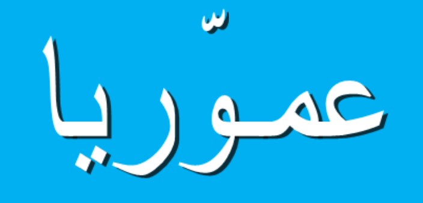

# عمّوريا (لغة برمجة عربية)

هذا المستودع يحتوي على الأكواد من مصدرها الرسمي بحيث تسهل الوصول إليها والتعديل والمساهمة، كما أنه بلغة قد انتهى زمنها وولّى، وهي لغة VB6، لكن أظن أن ما يهمنا هنا هو قواعد اللغة التي يمكن عمل مترجم compiler لها بالوسائل التقنية المتاحة حاليا.

مستند مشروع التخرج لمبتكر اللغة **عبد العظيم أحمد عمّوري**، حيث كان مشروع تخرجه من جامعة فيلادلفيا:

https://docs.google.com/document/d/e/2PACX-1vS-Av6LdcvpdRAYGYpNvVXoMDPbQLEpvFgH3k8SqJUAaCgqpUEvywpHQTpcA_4MFn3rKH8ozZQKokyd/pub

الموقع الرسمي للغة:

http://ammoria.sourceforge.net/ar/ar_index.html

> يمكن لصاحب المشروع الأصلي التواصل معنا ليصبح جزءا من المنظمة "مبادرة"
